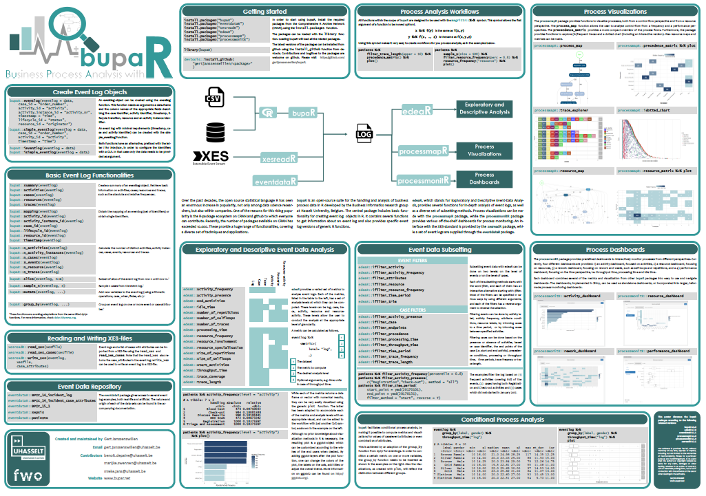

# process_mining

<h2>Business Process Analysis in R User Manual</h2>

**Suite of packages for the analysis of event logs (bupar)**

**Introduction \
This manual contains the steps necessary to make a typical analysis of log files using bupar on R. Below are the links necessary to go further or to see the tutorials necessary to master this subject.**

<h4>Links :</h4>

*   [https://www.coursera.org/learn/process-mining/](https://www.coursera.org/learn/process-mining/) :  A VERY COMPLETE TUTORIAL ON THE MINING PROCESS USING PROMTOOLS WHICH IS THE MOST KNOWN SOFTWARE FOR THIS AREA.
*   [https://www.bupar.net/getting_started.html](https://www.bupar.net/getting_started.html) : THE BUPAR WEBSITE, WHICH CONTAINS A USER MANUAL TO IMPLEMENT THE DIFFERENT METHODS.

<h4>The tools to get started:</h4>

1. A: to start, install the R software to interpret the R code.
2. R-studio: this software is a free, free and multiplatform development environment for R, you must install R before R-Studio and then you install R-Studio.
3. The necessary packages:

    To install a package, write: **install.packages** (“Nompackage”) and **library **(“Nompackage”) to import it

    1. Bupar : [https://cran.r-project.org/web/packages/bupaR/bupaR.pdf](https://cran.r-project.org/web/packages/bupaR/bupaR.pdf)
    2. xesreadR : [https://cran.r-project.org/web/packages/xesreadR/xesreadR.pdf](https://cran.r-project.org/web/packages/xesreadR/xesreadR.pdf)
    3. edeaR : [https://cran.r-project.org/web/packages/edeaR/edeaR.pdf](https://cran.r-project.org/web/packages/edeaR/edeaR.pdf)
    4. processmapR : [https://cran.r-project.org/web/packages/processmapR/processmapR.pdf](https://cran.r-project.org/web/packages/processmapR/processmapR.pdf)
    5. dplyr : [https://cran.r-project.org/web/packages/dplyr/dplyr.pdf](https://cran.r-project.org/web/packages/dplyr/dplyr.pdf)
    6. devtools : [https://cran.r-project.org/web/packages/devtools/devtools.pdf](https://cran.r-project.org/web/packages/devtools/devtools.pdf)
    7. processanimateR : [https://cran.r-project.org/web/packages/processanimateR/processanimateR.pdf](https://cran.r-project.org/web/packages/processanimateR/processanimateR.pdf)
    8. processmonitR  : [https://cran.r-project.org/web/packages/processmonitR/processmonitR.pdf](https://cran.r-project.org/web/packages/processmonitR/processmonitR.pdf)
    9. stringi : [https://cran.r-project.org/web/packages/stringi/stringi.pdf](https://cran.r-project.org/web/packages/stringi/stringi.pdf)

<h3>Description of the architecture of the Bupar package suite:</h3>

<h3>What to do ? :</h3>

There is a very well-known approach in the field of Process Mining and Data science to start a project, here are the different stages and the corresponding results:

1. **Extraction: **transform raw data into event data
2. **Preprocessing:** enrich and filter event data
1. **Aggregation** **: **remove redundant data
2. **filtering** **:** display models according to process instances or events
3. **Enrichment** **:**  add payload attributes
3. **Analysis** : get useful information in the process
1. **Organizational** : focus on the actors in a process and how they work together.
2. **Control flow** : focus on the flow and structure of the process, for example (A patient's journey to the emergency room ).
3. **Performance **: focuses on time and efficiency, for example (how long does it take before a patient can leave the ED? Or in what area or at what time of the day are the trains the most late?)
4. **Further:** are there links between actors and performance issues? .

<!-- Docs to Markdown version 1.0β17 -->
