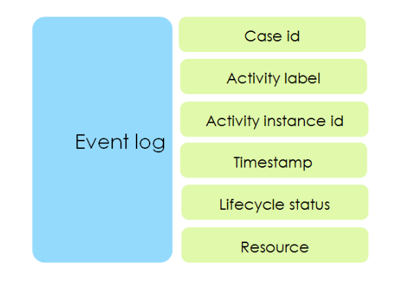
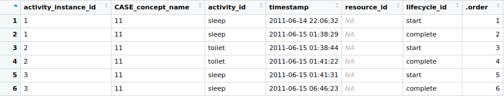
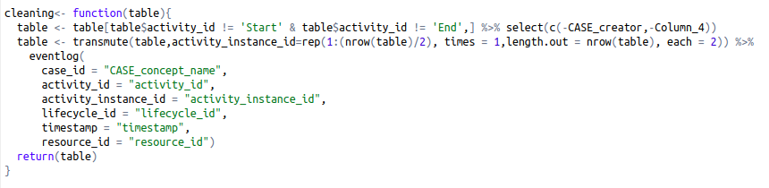

<h2>Business Process Analysis in R User Manual</h2>


<h3>R Suite of packages for the analysis of event logs (bupar)</h3>


**Introduction \
This manual contains the steps necessary to make a typical analysis of log files using bupar on R. Below are the links necessary to go further or to see the tutorials necessary to master this subject.**

<h4>Links :</h4>


*   [https://www.coursera.org/learn/process-mining/](https://www.coursera.org/learn/process-mining/) :  A VERY COMPLETE TUTORIAL ON PROCESS MINING USING PROMTOOLS WHICH IS THE MOST KNOWN SOFTWARE FOR THIS FIELD.
*   [https://www.bupar.net/getting_started.html](https://www.bupar.net/getting_started.html) : THE BUPAR WEBSITE, WHICH CONTAINS A USER MANUAL TO IMPLEMENT THE DIFFERENT METHODS.

<h4>The tools to get started:</h4>


1. R: to start, install the R software to interpret the R code.
2. R-studio: Multiplatform development environment for R, you must install R before R-Studio and then you install R-Studio.
3. The necessary packages:

    To install a package, write: **install.packages** (“Nompackage”) and **library**(“Nompackage”) to import it

    1. Bupar : [https://cran.r-project.org/web/packages/bupaR/bupaR.pdf](https://cran.r-project.org/web/packages/bupaR/bupaR.pdf)
    2. xesreadR : [https://cran.r-project.org/web/packages/xesreadR/xesreadR.pdf](https://cran.r-project.org/web/packages/xesreadR/xesreadR.pdf)
    3. edeaR : [https://cran.r-project.org/web/packages/edeaR/edeaR.pdf](https://cran.r-project.org/web/packages/edeaR/edeaR.pdf)
    4. processmapR : [https://cran.r-project.org/web/packages/processmapR/processmapR.pdf](https://cran.r-project.org/web/packages/processmapR/processmapR.pdf)
    5. dplyr : [https://cran.r-project.org/web/packages/dplyr/dplyr.pdf](https://cran.r-project.org/web/packages/dplyr/dplyr.pdf)
    6. devtools : [https://cran.r-project.org/web/packages/devtools/devtools.pdf](https://cran.r-project.org/web/packages/devtools/devtools.pdf)
    7. processanimateR : [https://cran.r-project.org/web/packages/processanimateR/processanimateR.pdf](https://cran.r-project.org/web/packages/processanimateR/processanimateR.pdf)
    8. processmonitR  : [https://cran.r-project.org/web/packages/processmonitR/processmonitR.pdf](https://cran.r-project.org/web/packages/processmonitR/processmonitR.pdf)
    9. stringi : [https://cran.r-project.org/web/packages/stringi/stringi.pdf](https://cran.r-project.org/web/packages/stringi/stringi.pdf)

<h3>Description of the architecture of the Bupar package suite:</h3>


<h3>What to do ? :</h3>


There is a very well-known approach in the field of Process Mining and Data science to start a project, here are the different stages and the corresponding results:


1. **Extraction:** transform raw data into event data
2. **Preprocessing:** enrich and filter event data
1. **Aggregation:**  remove redundant data
2. **filtering** **:** display models according to process instances or events
3. **Enrichment** **:**  add payload attributes
3. **Analysis** : get useful information in the process
1. **Organizational** : focus on the actors in a process and how they work together.
2. **Control flow** : focus on the flow and structure of the process, for example (A patient's journey to the emergency room)
3. **Performance:** focuses on time and efficiency, for example (how long does it take before a patient can leave the ED? Or in what area or at what time of the day are the trains the most late?)
4. **Further:** are there links between actors and performance issues? .


## I.	 EXTRACTION :

This part is very important, it allows to extract the data and transform them into datasets which can be treated in the analysis in Mining process, these transformed datasets must meet very specific criteria, for example they must have columns as **Case_id or activity_id…** according to the usefulness of each column and the criteria which it must follow:





**CASE_id:** contains unique values that identify instances of the process.

**Activity id :** Each instance of the process is a sequence of events which consists in doing a well defined activity and activity_id contains the label of this activity for example: the Eating activity



**Activity instance Id :** this attribute designates the different instances of each activity during the events, for example someone can instantiate the sleeping activity and each instance of this activity has a unique identifier.

**Lifecyle :** life cycle contains the different states of the activity instances such as start which indicates that this activity has just started, Pause which means that it is paused and complete which shows that this activity instance has ended.

**Timestamp :** allows you to record the exact moment of events ("date and time").

**Ressource :**  identifies the different actors in the process, i.e. those who did the activity or carried out the task, this column may be empty if the event log corresponds to only one actor.


#### Creation of an event log:

The events log that bupar accepts must be in XES or CSV format or database, we can structure the dataset using the function:

 eventlog(

        case_id = "patient",

        activity_id = "activity",

        activity_instance_id = "activity_instance",

        lifecycle_id = "status",

        timestamp = "timestamp",

        resource_id = "resource"

    )

by specifying for each attribute of the table the corresponding column in the format of standard event logs.

There are different types of problem that can be encountered concerning the values of these attributes, for example if the **CASE_id** is not unique, we must do some cleaning to resolve the problem. One problem we encountered with our data sets is that there were two more columns that are useless, that the **CASE_id** was written **CASE_CONCEPT_NAME** and that the attribute **activity_instance_id** does not contain unique values. Here is one of our methods for cleaning:




The method to import the dataset if it is in XES format is:


```
read_xes("chemin_complet_menant_au_dataset") 	
```


specifying the path of the file. Otherwise if it is in another format you import it with :


```
read.table("lechemin") ou read.csv("") …
```


Finally, to execute the code, you must open it with RStudio for example (recommended), specify the correct paths for the data sets in the read_xes functions (line 43 to 50). Then, either select everything and click on the run button (to run everything at once); either position yourself on a line and do “ctrl + enter” (this to execute the lines one by one).


## II.	 PREPROCESSING and III. Analyzes :

